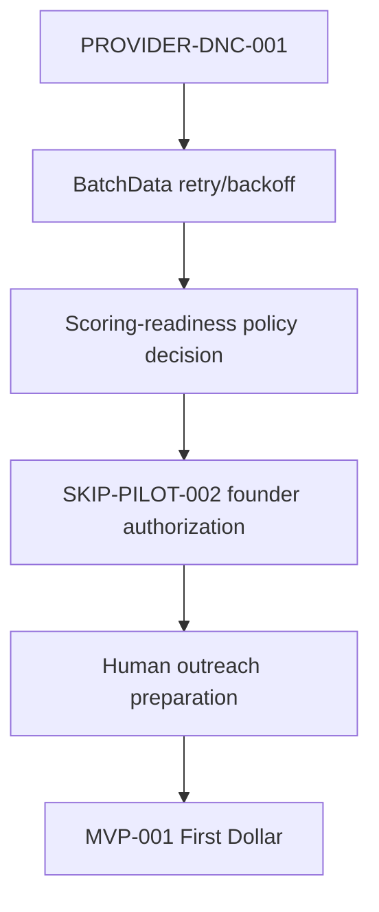

# LUX — Executive Progress Dashboard

*Diagrams first. Full narrative: [`CEO_BRIEF.md`](CEO_BRIEF.md). Authoritative detail: [`AGENTS.md`](AGENTS.md). Reconciled by STATE-RECONCILE-001, 2026-08-12.*

## Roadmap position

Green = live. Orange = blocked/gated. Gray = not authorized.

Current gap: compliance/provider gate before paid identification. No paid
skip-trace or outreach is authorized.

## MVP-001

Current production has seller evidence, buyer intelligence, and matches. It
does not yet have founder-authorized paid identification, callable contacts, or
outreach sends.

## Verified production metrics

| Metric | 2026-08-12 production |
|---|---:|
| Assets | 532,451 |
| Transactions | 159 |
| Transactions linked to Assets | 34 |
| Transaction→Asset coverage | 21.38% |
| SourceRecords | 560,102 |
| Observations | 11,255,764 |
| RawEvidence | 53 |
| PipelineRuns | 82 |
| Scored buyers | 57 |
| Persisted/quality-analyzed matches | 957 |
| Financial-opportunity observations | 821 |
| Asset-linked financial observations | 28 |
| Canonical facts | 0 |

## Capability status

| Capability | Status |
|---|---|
| Buyer intelligence | Live |
| Asset-scoped seller opportunities | Live |
| Explainable matching | Live |
| Match-quality analysis | Live |
| Candidate ranking | Live |
| Revenue qualification packet | Live |
| Skip-trace/DNC shadow validation | Live, read-only |
| Paid provider call | Not authorized |
| Outreach send | Not authorized |

## Current blockers

| Blocker | State |
|---|---|
| PROVIDER-DNC-001 | Hard compliance blocker before paid pilot/live callable contacts |
| BatchData retry/backoff | Open resilience gap before unattended provider reliance |
| Scoring-readiness policy | Founder decision; current graph coverage is below existing threshold |
| SKIP-PILOT-002 | Founder authorization required |
| FACT-LIVE-001/002 | Canonical facts absent in Railway production; audit follow-up |

## Next priorities

Nothing in this file is a second source of truth. `AGENTS.md` remains
authoritative; this is the compact executive/mirror view.
