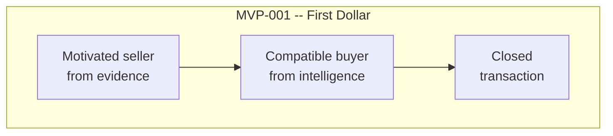
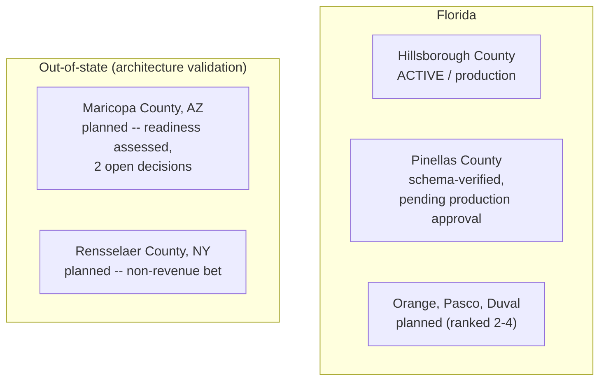
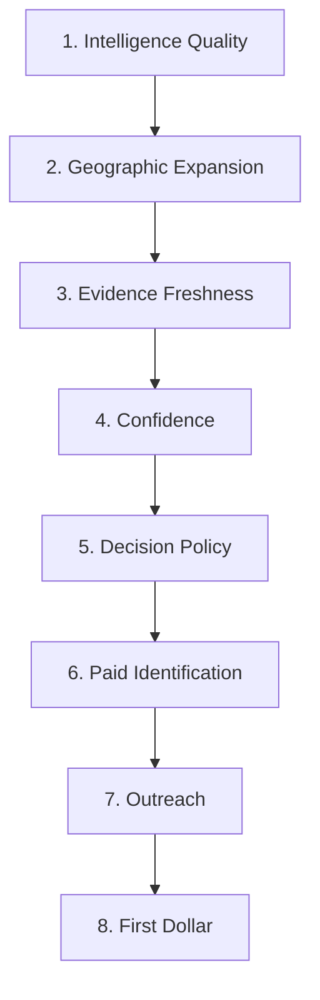

# LUX — Executive Progress Dashboard

*Diagrams first. Full narrative and open decisions: [`CEO_BRIEF.md`](CEO_BRIEF.md). Authoritative detail: [`AGENTS.md`](AGENTS.md). Generated/reconciled by SPRINT-005-GOV, 2026-07-25.*

## Where LUX is on its own roadmap

**Green = live. Orange = in progress now. Gray = not started.**
Evidence and Intelligence are live and continuously automated (SPRINT-004).
Confidence is live (v1, uncalibrated, versioned). **Decision policy —
turning confidence into an explicit "ready for paid identification"
threshold — is the current gap**, and is SPRINT-005's stated objective.

## Current milestone

Close one real wholesale transaction entirely sourced and matched through
LUX. Not yet reached — blocked on the Lead Engine go-live sequence
(LEADGEN-002 through 005) plus SPRINT-005's decision-policy work.

## Current geography

Hillsborough is the only jurisdiction with approved production writes.
Pinellas is fully schema-verified against real live data (SPRINT-003) but
`database_write_allowed`/`ingest_supported` remain `false` pending Jaia's
explicit approval. Maricopa/Rensselaer have no adapter code yet.

## Engine maturity (infrastructure)

| Component | Status |
|---|---|
| Canonical data model | Complete |
| Public-record ingestion (Hillsborough) | Complete, production |
| Immutable provenance (RawEvidence → SourceRecord → Observation) | Complete |
| Deterministic Transaction→Asset linking | Complete |
| Read-only computed graph queries | Complete |
| Generic connector scheduling + checkpoints (SPRINT-004) | Complete |
| Evidence events + targeted rescoring (SPRINT-004) | Complete |

## Intelligence maturity

| Component | Status |
|---|---|
| Seller pressure (INTEL-001) | v1 live |
| Buyer demand (INTEL-002) | v1 live |
| Ranked matching (DATA-009 + MATCH-001) | v1 live |
| Confidence layer, separate from opportunity strength (SPRINT-004) | v1 live, **uncalibrated** |
| Continuous prioritization + rank history (SPRINT-004) | v1 live |
| Paid-action simulation, read-only (SPRINT-004) | v1 live |
| Decision policy (explicit "ready for paid ID" threshold) | **not yet defined — SPRINT-005** |
| Human-reviewed outreach (OUTREACH-001) | v1 live, mock contacts only |

## Next priorities (reconciled order)

Full detail: `ROADMAP.yaml`'s `next_priority_order`. Note this is a
priority ranking, not a strict sequential gate — Outreach (OUTREACH-001)
has already shipped mechanically; it ranks lower here because it isn't
the current bottleneck, not because it's blocked.

## What's actually open right now

See `OPEN_DECISIONS.yaml` for the full list. In one line each:
Pinellas production approval · Kyle/INGEST-002 ownership question ·
2 Maricopa readiness decisions · VACANCY-001 / HEIR-001 signal proposals.

## Reading this file

This is the diagrams-first snapshot. Nothing here is a second source of
truth — `AGENTS.md` is authoritative, `CEO_BRIEF.md` carries the narrative
and full decision log, and this file is regenerated whenever either
changes materially.
